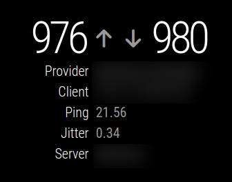

# MMM-SpeedTest

This is a module for the [MagicMirror²](https://github.com/MichMich/MagicMirror/).

This module use speedtest command (OOKLA) to get and show speed test results

## Example



## Using the module

To use this module, add the following configuration block to the modules array in the `config/config.js` file:

```js
var config = {
  modules: [
    {
      module: "MMM-SpeedTest",
    }
  ]
};
```
